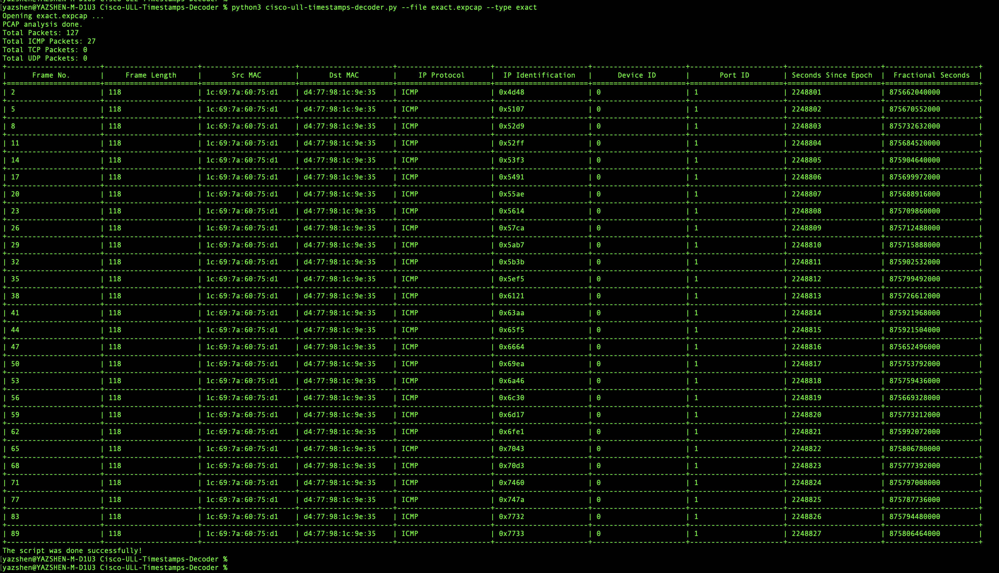

# Cisco ULL Timestamps Decoder

## Readme

This script will help user to decode timestamp information from packet which is captured by Nexus 3550-F HPT Switch, Nexus 3550-T Switch, exanic-capture Software and exact-capture Software.

Link: https://github.com/yazshen/cisco-ultra-low-latency/blob/main/cisco-ull-timestamps-decoder/cisco-ull-timestamps-decoder.py

Author: Robbie Shen (yazshen@cisco.com)

## Release

2023.03.29: Init release


## Prerequisites

- Python 3.10.x or higher, verified on 3.11.2
- pip3 install scapy
- pip3 install texttable


## How-To

cisco-ull-timestamps-decode.py [-h] --file <pcap file name> --type {3550fhpt,3550t,exanic,exact}

```bash
options:
 -h, --help															show this help message and exit
 --file <pcap file name>								pcap file to decode
 --type {3550fhpt,3550t,exanic,exact}		packet captured by (Nexus 3550-F HPT, Nexus 3550-T, Exanic-Capture, Exact-Capture)
```


## Example

Decoder timestamp information from file captured by exact-software

```bash
python3 cisco-ull-timestamps-decoder.py --file exact.expcap --type exact
```


