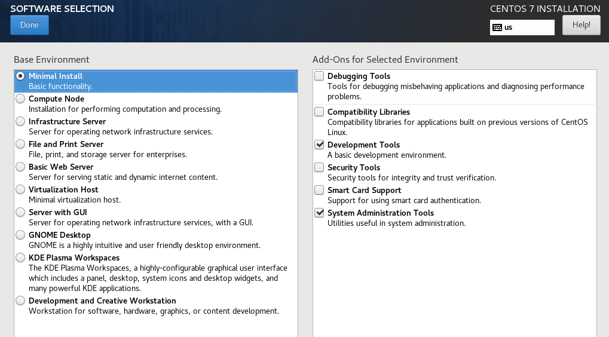
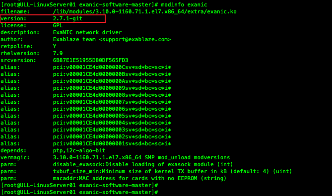
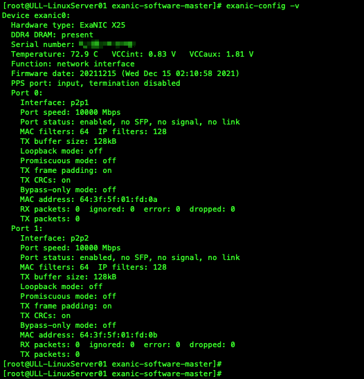
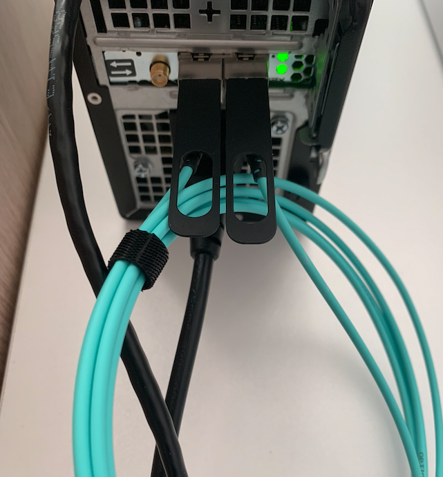
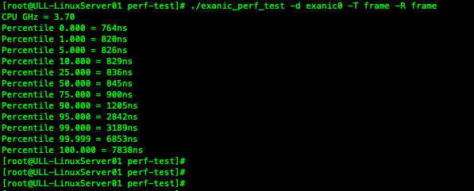
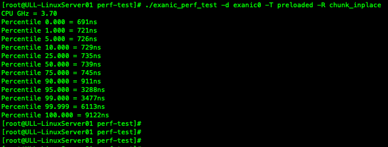
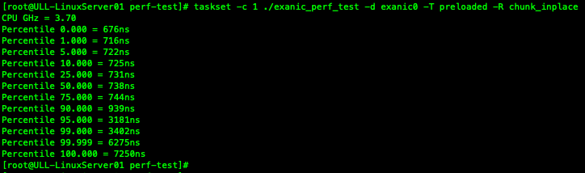
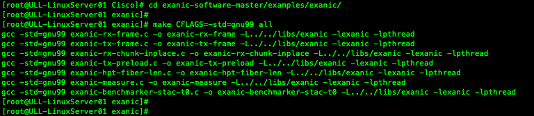
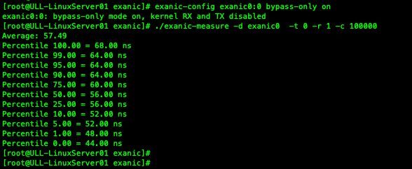
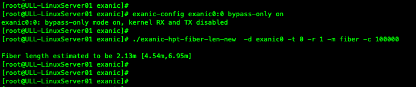

# Cisco SmartNIC 101 - (1) Install Driver on Linux

## Author

Robbie Shen (yazshen@cisco.com)

## Modified Date

2022.07.10

## Recommended Linux Distributions

| Distribution | Release | Kernel      |
| ------------ | ------- | ----------- |
| RHEL         | 8.4     | 4.18.0-305  |
| RHEL         | 7.9     | 3.10.0-1160 |
| CentOS       | 8.4     | 4.18.0-305  |
| CentOS       | 7.9     | 3.10.0-1160 |
| Ubuntu       | 21.04   | 5.11.0-25   |
| Ubuntu       | 20.04.2 | 5.4.0-80    |

## Testbed Information

| Component             | Type and Model            | Version                  |
| --------------------- | ------------------------- | ------------------------ |
| Cisco SmartNIC        | Nexus K3P-S with 4GB DDR4 | Firmware: 20211215       |
| Linux Distribution    | CentOS 7.9.2009           | Kernel: 3.10.0-1160.71.1 |
| Cisco SmartNIC Driver | Source-Code Driver        | 2.7.1-git                |

## Install CentOS Linux 7.9

Minimal installation with Developerment Tools and System Administration Tools



Use YUM to update existing packages and install additional packages

```
yum update -y
yum install wget tcpdump net-tools libnl3-devel -y
```

## Install Cisco SmartNIC Driver

Download source-code driver from Github and unzip it

```
wget https://github.com/cisco/exanic-software/archive/refs/heads/master.zip
unzip master.zip
cd exanic-software-master
```

Compile and install driver

```
make && make install
```

Use MODPROBE to load SmartNIC driver that is built into kernel module

```
modprobe exanic
```

Verifiy SmartNIC driver version

```
modinfo exanic
```



Check SmartNIC information and running status

```
exanic-config -v
```



## Raw Frame Benchmarking

Connect Port 0 and Port 1 using DAC cable



Compile perf-test utility in source-code driver

```
cd exanic-software-master
cd perf-test
make exanic
```

Run perf-test and test raw frame from Port 0 to Port 1

```
./exanic_perf_test -d exanic0 -T frame -R frame
```



Improve performance with libexanic(Hardware API Library)

```
./exanic_perf_test -d exanic0 -T preloaded -R chunk_inplace
```



Use TASKSET to execute perf-test with libexanic on designated CPU Core (#1)

```
taskset -c 1 ./exanic_perf_test -d exanic0 -T preloaded -R chunk_inplace
```



## Example Applications for HPT SmartNIC

Compile several applications in source-code driver

```
cd exanic-software-master/examples/exanic/
make CFLAGS=-std=gnu99 all
```



Run measurement application to benchmark external devices

```
exanic-config exanic0:0 bypass-only on
./exanic-measure -d exanic0  -t 0 -r 1 -c 100000
```



Run measurement application to estimate the length of cable

```
exanic-config exanic0:0 bypass-only on
./exanic-hpt-fiber-len  -d exanic0 -t 0 -r 1 -m fiber -c 100000
```



## References

1. Cisco Nexus SmartNIC User Guide: https://www.cisco.com/c/en/us/td/docs/dcn/nexus3550/smartnic/sw/user-guide/cisco-nexus-smartnic-user-guide/index.html

2. Cisco Nexus SmartNIC Firmware Download Link: https://software.cisco.com/download/home/286326311

3. Cisco Nexus SmartNIC Source-Code Repository: https://github.com/cisco/exanic-software

4. Cisco Nexus SmartNIC Release Notes: https://github.com/cisco/exanic-software/blob/master/RELEASE-NOTES.txt

5. Troubleshoot Cisco Nexus SmartNIC Installation: https://www.cisco.com/c/en/us/support/docs/interfaces-modules/nexus-smartnic/216036-troubleshoot-nexus-smartnic-hardware-and.html

