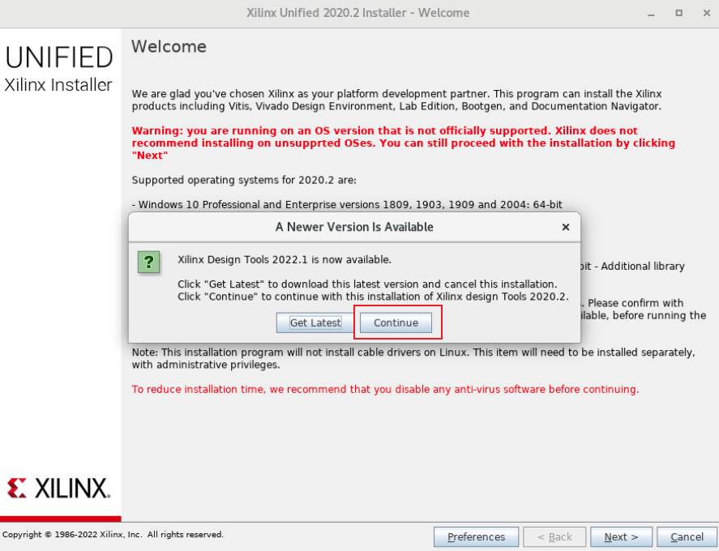
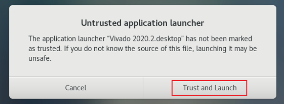

# Cisco SmartNIC 101 - (2) Configure Nexus FDK environment

## Author

Robbie Shen (yazshen@cisco.com)

## Modified Date

2022.07.29

## Testbed Information

| Component             | Type and Model            | Version                  |
| --------------------- | ------------------------- | ------------------------ |
| Cisco SmartNIC        | Nexus K3P-S with 4GB DDR4 | Firmware: 20211215       |
| Linux Distribution    | CentOS 7.9.2009           | Kernel: 3.10.0-1160.71.1 |
| Cisco SmartNIC Driver | Source-Code Driver        | 2.7.1-git                |
| Cisco Nexus FDK       | Free Version              | 2.9.0                    |
| Xilinx Vivado         | WebPack Version (Free)    | 2020.2                   |

## Install Gnome GUI on Linux

Install Gnome GUI package using YUM command

```
yum group list
yum groupinstall "Server with GUI"
```

Enable GUI on system startup, then reboot your machine

```
ln -sf /lib/systemd/system/runlevel5.target /etc/systemd/system/default.target
reboot
```

## Install Xilinx Vivado for Linux

Download Xinlinx Vivado Linux Web Installer or Full Installer


Extract Full Installer and start installation

```
tar zxf Xilinx_Unified_2020.2_1118_1232.tar.gz
cd Xilinx_Unified_2020.2_1118_1232
chmod +x xsetup && ./xsetup
```

Click "Continue" and do not download the latest version



Click "Next"


Choose "Vivado" and click "Next"


Choose "Vivado HL WebPACK" and click "Next"


You can use Xilinx Free WebPACK License to develop application on K35-S/K35-Q/K3P-S/K3P-Q, but Paid License is required on V5P/V9P/V9P-3.

Click "Next"


Check all "I Agree" and click "Next"


Choose installation destination directory and click "Next"


Click "Yes"


Click "Install" to start installation


Click "OK" to complete installation


Double-click "Vivado 2020.2.Desktop" icon on your desktop, click "Trust and Launch" and verify if Vivado can be run



Vivado GUI can be closed, it is not required for us to build custom application using Nexus FDK. Let's go back to CLI now.

## Configure Xilinx Environment

Source settings

```
cat source /tools/Xilinx/Vivado/2020.2/settings64.sh
source /tools/Xilinx/Vivado/2020.2/settings64.sh
echo 'source /tools/Xilinx/Vivado/2020.2/settings64.sh'>>/etc/profile
```


## Configure Cisco Nexus FDK Environment

Download Nexus FDK 2.9.0 free version from Cisco WebSite and extract the tar file

Run "make" command to see all available values for PLATFORM/VARIANT/TARGET

```
yum install tcl -y
tar zxvf exanic-devkit-free-2.9.0.tar.gz
cd exanic-devkit-free-2.9.0
make
```


## Build example application from Nexus FDK

Try to build an example applicaton "ping_example" from FDK, then flash new firmware to SmartNIC

```
cd exanic-devkit-free-2.9.0
make PLATFORM=x25 TARGET=ping_example VARIANT=free
cd outputs
exanic-fwupdate exanic_x25_ping_example.fw
exanic-fwupdate -r
exanic-config -v
```


Go to "example" folder under souce-code driver and compile example applications

```
cd exanic-software-master/examples/devkit
make all
```


Run "ping-example" to send ICMP to custom applilcation on SmartNIC, SmartNIC will complete ARP and ICMP process. You can run "arp -a" command to verify if Linux OS involved

```
./ping-example exanic0 172.16.100.111 172.16.100.200
```


## References

1. Cisco Nexus FDK Download Link: https://software.cisco.com/download/home/286326480/type/286326855/release/
1. Cisco Nexus FDK User Guide: https://exablaze.com/docs/fdk-guide/exanic_fdk/
2. Xilinx Vivado 2020.2 Download Link: https://www.xilinx.com/support/download/index.html/content/xilinx/en/downloadNav/vivado-design-tools/archive.html
3. Xilinx Vivado 2020.2 Installation Guide: https://www.xilinx.com/support/documentation-navigation/design-hubs/2020-2/dh0013-vivado-installation-and-licensing-hub.html

