# 思科FPGA智能网卡使用手册


## 1. 文档控制

| 版本 | 日期       | 作者                       | 备注                                                 |
| ---- | ---------- | -------------------------- | ---------------------------------------------------- |
| V1.0 | 2022.09.09 | 申亚中 (yazshen@cisco.com) | 初稿                                                 |
| V1.1 | 2022.11.16 | 申亚中 (yazshen@cisco.com) | 增加缓存信息说明<br />增加透明加速下双向同时抓包说明 |
| V1.2 | 2023.01.05 | 申亚中(yazshen@cisco.com)  | 更新libnl3-devel说明和kernel-header安装步骤          |
| V1.3 | 2023.01.16 | 申亚中(yazshen@cisco.com)  | 更新exanic-capture和exact-capture使用说明            |
| V1.4 | 2023.02.17 | 申亚中(yazshen@cisco.com)  | 更新常见问题解答和技术支持流程                       |
| V1.5 | 2023.02.27 | 申亚中(yazshen@cisco.com)  | 更新网卡物理尺寸信息                                 |
| V1.6 | 2023.03.28 | 申亚中(yazshen@cisco.com)  | 更新时钟同步说明和时间戳解析脚本工具                 |


## 2. 思科FPGA智能网卡产品介绍

| Exablaze产品名称 | Cisco产品名称                      | Cisco产品SKU     |
| ---------------- | ---------------------------------- | ---------------- |
| ExaNIC x10       | Nexus X10 SmartNIC K35-S           | NXN-K35-2X=      |
| ExaNIC x40       | Nexus X40 SmartNIC K35-Q           | NXN-K35-8X=      |
| ExaNIC x25       | Nexus X25 SmartNIC K3P-S           | NXN-K3P-2X=      |
| ExaNIC x25 DDR   | Nexus X25 SmartNIC K3P-S with DDR  | NXN-K3P-2X-4GB=  |
| ExaNIC x100      | Nexus X100 SmartNIC K3P-Q          | NXN-K3P-8X=      |
| ExaNIC x100 DDR  | Nexus X100 SmartNIC K3P-Q with DDR | NXN-K3P-8X-9GB=  |
| ExaNIC v5P       | Nexus SmartNIC+ V5P                | NXN-V5P-8X-9GB=  |
| ExaNIC v9P       | Nexus SmartNIC+ V9P                | NXN-V9P-16X-9GB= |
|                  | Nexus SmartNIC+ V9P-3              | NXN-V9P3-16X-9GB |
| ExaNIC HPT       | Nexus NIC HPT                      | NXN-GM=          |
| ExaNIC GM        | Nexus NIC GM                       | NXN-HPT=         |

官方说明链接：https://www.cisco.com/c/en/us/about/corporate-strategy-office/acquisitions/exablaze.html#~tab-products

官方说明链接：https://www.cisco.com/c/en/us/products/se/2020/7/Collateral/guide-c07-743799.html#CiscoNexusSmartNICAdapters


| 型号        | PCI-E规格 / 尺寸                | FPGA芯片 | 物理端口                                     | 端口速率        | 特殊功能                                                     | PPS in/out | FPGA应用 |
| ----------- | ------------------------------- | -------- | -------------------------------------------- | --------------- | ------------------------------------------------------------ | ---------- | -------- |
| K35-S(X10)  | PCIe x8 Gen 3<br />117 * 68 mm  | KU035-2  | 2 x SFP+                                     | 100M/1G/10G     | 端口镜像<br />端口桥接<br />NTP/PTP<br />时间戳<br />硬件API<br />Kernel Bypass | 支持       | 支持     |
| K35-Q(X40)  | PCIe x8 Gen 3<br />150 * 68 mm  | KU035-2  | 2 x QSFP+<br />(2 x 40GbE)<br />(8 x 10GbE)  | 100M/1G/10G/40G | NTP/PTP<br />时间戳<br />硬件API<br />Kernel Bypass          | 支持       | 支持     |
| K3P-S(X25)  | PCIe x8 Gen 3<br />117 * 68 mm  | KU3P-2   | 2 x SFP28                                    | 100M/1G/10G/25G | 可选4GB DDR4<br />端口镜像<br />端口桥接<br />NTP/PTP<br />时间戳<br />硬件API<br />Kernel Bypass | 支持       | 支持     |
| K3P-Q(X100) | PCIe x8 Gen 3<br />117 * 68 mm  | KU3P-2   | 2 x QSFP28<br />(2 x 40GbE)<br />(8 x 10GbE) | 100M/1G/10G/40G | 可选9GB DDR4<br />端口镜像<br />NTP/PTP<br />时间戳<br />硬件API<br />Kernel Bypass | 支持       | 支持     |
| V5P         | PCIe x8 Gen 3<br />168 * 69 mm  | VU5P-2   | 2 x QSFP28<br />(8 x 10GbE)                  | 100M/1G/10G     | 内置9GB DDR4<br />ATE<br />NTP/PTP<br />时间戳<br />硬件API<br />Kernel Bypass | 支持       | 支持     |
| V9P         | PCIe x16 Gen 3<br />168 * 69 mm | VU9P-2   | 2 x QSFP-DD<br />(16 x 10GbE)                | 100M/1G/10G     | 内置9GB DDR4<br />NTP/PTP<br />时间戳<br />硬件API<br />Kernel Bypass | 支持       | 支持     |
| V9P-3       | PCIe x16 Gen 3<br />168 * 69 mm | VU9P-2   | 2 x QSFP-DD<br />(16 x 10GbE)                | 100M/1G/10G     | 内置9GB DDR4<br />NTP/PTP<br />时间戳<br />硬件API<br />Kernel Bypass | 支持       | 支持     |
| GM          | PCIe x8 Gen 3<br />150 * 68 mm  | KU035-2  | 2 x SFP+                                     | 100M/1G/10G     | 时间源<br />内置OCXO<br />NTP/PTP<br />时间戳<br />硬件API<br />Kernel Bypass | 支持       | 否       |
| HPT         | PCIe x8 Gen 3<br />150 * 68 mm  | KU035-2  | 2 x SFP+                                     | 100M/1G/10G     | NTP/PTP<br />内置OCXO<br />时间戳<br />硬件API<br />Kernel Bypass | 支持       | 否       |

注1：25GbE/40GbE需要指定的网卡固件版本支持

注2：端口镜像/端口桥接需要指定的网卡固件版本支持

注3：V5P/V9P/V9P-3网卡运行过程中可能会超过PCIe插槽功率，建议要连接12V GPU电源（原厂包装内提供转接头）


思科官方固件的缓存配置

| 型号        | 接收缓存 | 发送缓存                                                     |
| ----------- | -------- | ------------------------------------------------------------ |
| K35-S(X10)  | 2MB      | 128KB per port (256KB total)                                 |
| K35-Q(X40)  | 2MB      | 64KB per port (512KB total)                                  |
| K3P-S(X25)  | 2MB      | 默认：128KB per port (256KB total)<br />可选：1MB per port (2MB total, TX方向延迟增加约20ns) |
| K3P-Q(X100) | 2MB      | 默认：64KB per port (512KB total)<br />可选：256KB per port (2MB total, TX方向延迟增加约20ns) |
| V5P         | 2MB      | 64KB per port (512KB total)                                  |
| GM          | 2MB      | 128KB per port (256KB total)                                 |
| HPT         | 2MB      | 128KB per port (256KB total)                                 |


## 3. 思科FPGA智能网卡驱动程序说明

| 硬件平台 | RHEL | CentOS | Ubuntu | Fedora 32 | 源码 |
| -------- | ---- | ------ | ------ | --------- | ---- |
| X86_64   | 支持 | 支持   | 支持   | 支持      | 支持 |

| 操作系统      | 驱动程序安装包链接                       |
| ------------- | ---------------------------------------- |
| RHEL / CentOS | https://exablaze.com/downloads/yum/      |
| Ubuntu        | https://exablaze.com/downloads/apt/      |
| Source-Code   | https://github.com/cisco/exanic-software |

推荐版本：**2.7.2** 或 **2.7.3**


## 4. 思科FPGA智能网卡辅助应用说明

| 名称              | 说明                                                    |
| ----------------- | ------------------------------------------------------- |
| exanic-config     | 查看网卡状态和配置相关功能                              |
| exanic-fwupdate   | 更新网卡的固件或写入用户的FPGA应用                      |
| exasock           | Kernel Bypass用途，为应用程序提供透明加速功能           |
| exasock-stat      | 查看exasock模式下的tcp/ip连接信息                       |
| exanic-clock-sync | 硬件辅助的时间同步配置程序                              |
| exact-capture     | 高速无损的抓包工具，对入向流量进行捕捉，支持10G/25G速率 |


## 5. 服务器预配置

### 5.1. BIOS中关闭Secure Boot

UEFI固件中如果启用了Secure Boot Protocol后，会导致"modprobe exanic"加载驱动失败："modprobe: Required key not available"

### 5.2. Linux操作系统预选安装GCC等编译工具

例如CentOS在最小化安装选型中，增加"Development Tools"

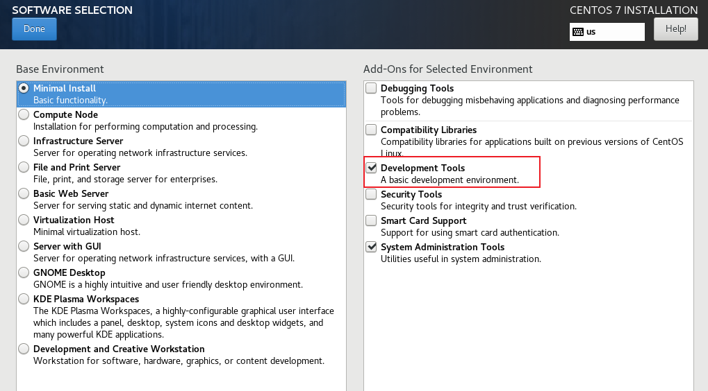


## 6. RHEL/CentOS/Fedora平台：RPM驱动安装步骤

添加EPEL仓库源，用于安装dkms组件

```bash
yum install epel-release
```

创建新的SmartNIC仓库源

```bash
vi /etc/yum.repos.d/exablaze.repo
```

编辑仓库源信息(RHEL 7 / CentOS 7环境)

```bash
[exablaze]
name=Exablaze
baseurl=http://exablaze.com/downloads/yum/redhat/el7/x86_64/
enabled=1
gpgcheck=1
gpgkey=http://exablaze.com/downloads/GPG-KEY-exablaze
```

编辑仓库源信息(RHEL 8 / CentOS 8环境)

```bash
[exablaze]
name=Exablaze
baseurl=http://exablaze.com/downloads/yum/redhat/el8/x86_64/
enabled=1
gpgcheck=1
gpgkey=http://exablaze.com/downloads/GPG-KEY-exablaze
```

编辑仓库源信息(Fedora 32环境)

```bash
[exablaze]
name=Exablaze
baseurl=http://exablaze.com/downloads/yum/redhat/fc32/x86_64/
enabled=1
gpgcheck=1
gpgkey=http://exablaze.com/downloads/GPG-KEY-exablaze
```

刷新仓库源

```bash
yum repolist
```

安装驱动程序

```bash
yum install exanic
```

加载驱动程序

```bash
modprobe exanic
```

查看驱动程序信息和版本

```bash
modinfo exanic
```

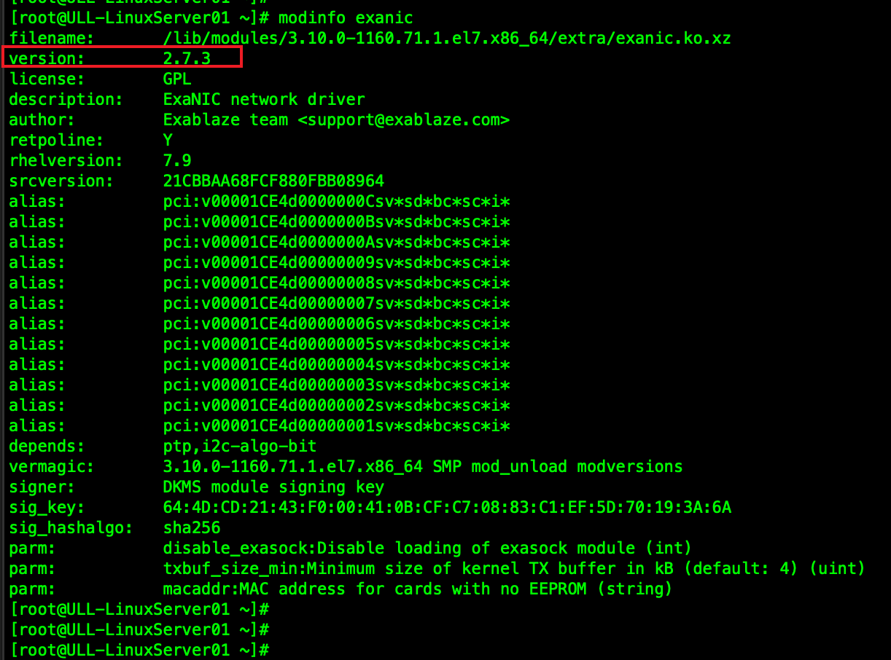

查看SmartNIC网卡信息，包括：设备序列号、温度、功能模式、固件版本等信息

```bash
exanic-config -v
```


## 7. RHEL/CentOS/Fedora平台：Source-Code源码驱动安装步骤

（可选）安装libnl3-devel组件，用于exasock-stat应用

```bash
yum install libnl3-devel
```

确认系统是否安装Linux kernel-header组件

```
yum list kernel-headers
```

如果没有，下载安装对应当前kernel版本的header组件

```
yum install kernel-devel-$(uname -r)
```

从GitHub.com网站下载源码

```bash
wget https://github.com/cisco/exanic-software/archive/refs/heads/master.zip
```

解压zip文件并进入源码目录

```bash
unzip master.zip
cd exanic-software-master
```

编译并安装

```bash
make && make install
```

加载驱动程序

```bash
modprobe exanic
```

查看驱动程序信息和版本

```bash
modinfo exanic
```

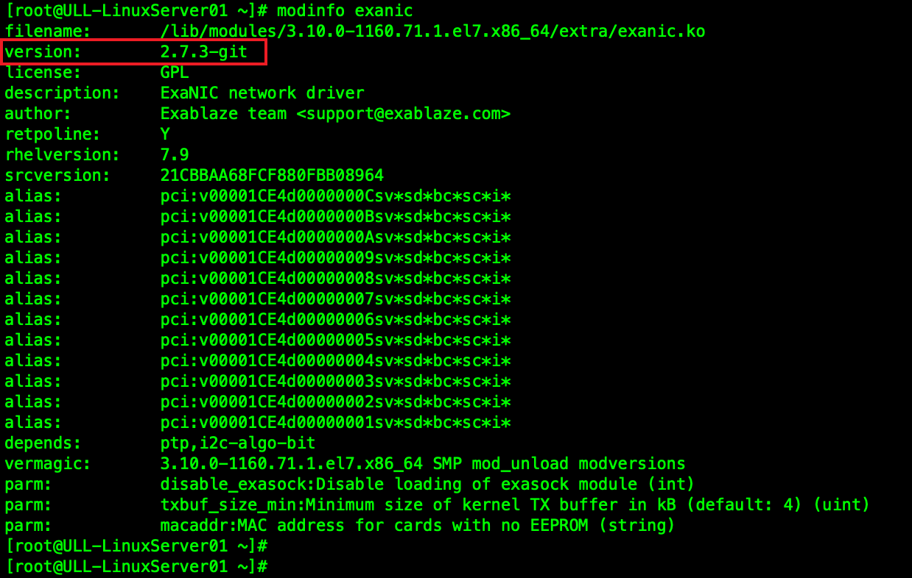

查看SmartNIC网卡信息，包括：设备序列号、温度、功能模式、固件版本等信息

```bash
exanic-config -v
```

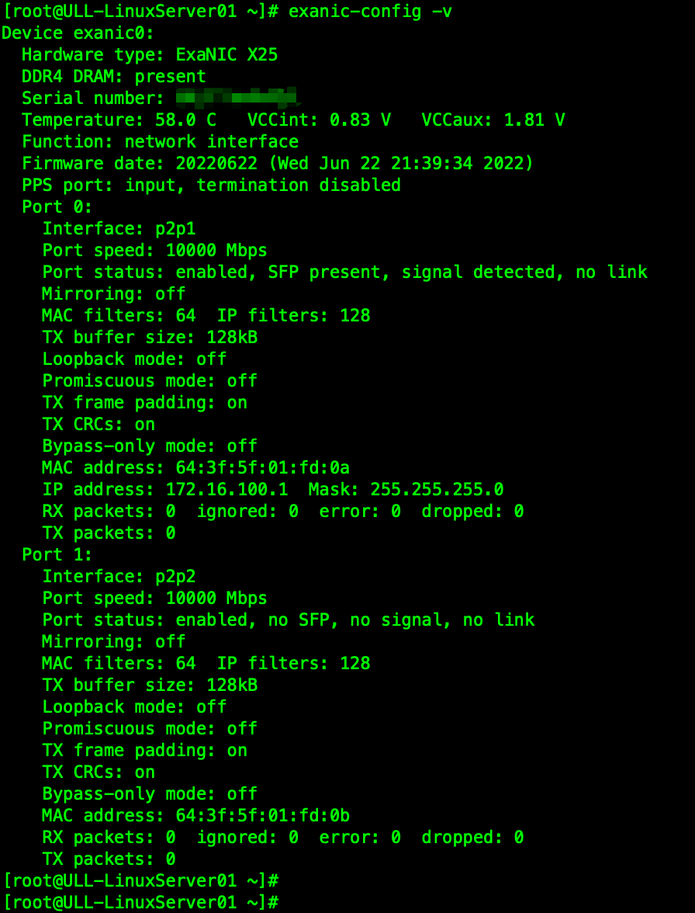


## 8. 源码驱动程序升级更新步骤

源码驱动程序升级之前，建议把当前版本卸载，然后再安装新版本的驱动程序

```bash
modprobe -r exasock
modprobe -r exanic
cd <old source-code folder>
make uninstall
```

删除/etc/udev/rules.d/exanic.rules相关文件，删除运行exanic-clock-sync的相关脚本

完成删除后，安装全新安装的步骤，安装新版本驱动程序


## 9. 固件更新

Cisco不定期会对不同型号的SmartNIC进行固件更新，包括：BUG修复、性能改善、功能增强、不同规格发送缓存等。Cisco官方固件下载链接：https://software.cisco.com/download/home/286326311 

查看当前官方下载页面上的文件校验信息

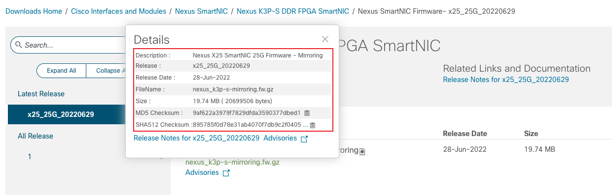

下载官方固件文件后，校验文件

```bash
sha512sum exanic_xxxxx.fw.gz
```

解压文件

```bash
gzip –d exanic_xxxx.fw.gz
```

更新固件(不指定网卡)

```bash
exanic-fwupdate exanic_xxxx.fw
```

更新固件(如果服务器上有多个网卡，可以指定网卡进行更新)

```bash
exanic-fwupdate -d exanic1 exanic_xxxx.fw
```

 重启网卡并激活新的固件

```bash
exanic-fwupdate –r
```

如果重启网卡失败，可以重启服务器来激活新的固件

```bash
reboot
```

确认当前网卡的固件版本

```bash
exanic-config -v
```

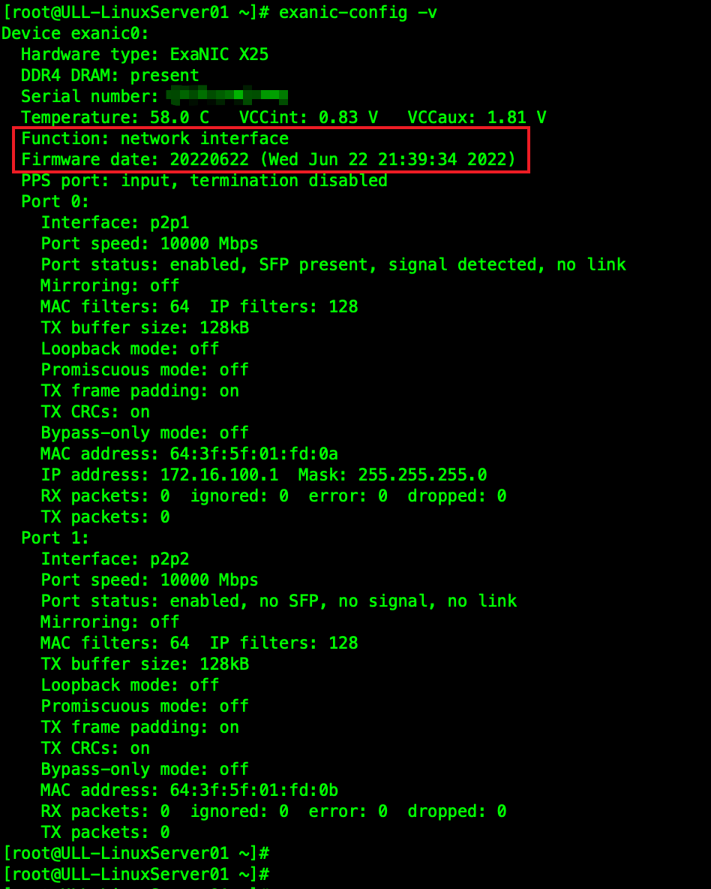


## 10. 固件重置

Cisco SmartNIC网卡分别存储"production"和"recovery"固件。如果重启网卡之后，发现固件有异常，那么可以通过如下方式进行固件重置

可以通过在网卡通电时按住恢复按钮来启动恢复镜像。在 Cisco Nexus SmartNIC K35-S（以前称为 X10）上，红色 LED 将亮起，表示正在启动恢复程序。在 Cisco Nexus SmartNIC K35-Q（以前称为 X40）、Cisco Nexus SmartNIC K3P-Q（以前称为 X100）和 Cisco Nexus SmartNIC+ V5P 卡上，链路指示灯将以琥珀色交替闪烁。

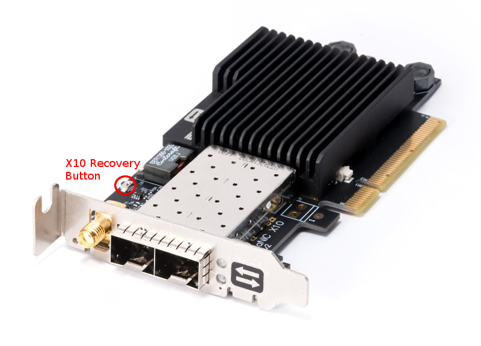


## 11. exanic-config工具用途

查看网卡当前状态和信息

```bash
exanic-config -v
```

> 网卡型号
>
> 是否内置DDR4内存
>
> 网卡序列号
>
> 温度
>
> 电压
>
> 网卡模式：Cisco官方网卡固件、用户FPGA应用
>
> PPS状态
>
> 网卡接口统计信息
>
> 特殊功能模式：Loopback, Promisuous, Bypass-only, Mirror, Bridge

查看网卡接口上光模块DOM信息

```bash
exanic-config exanic0:0 sfp status
```

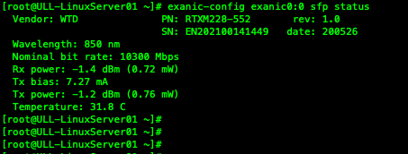

指定网卡接口上的端口速率

```bash
exanic-config exanic0:0 speed 100 | 1000 | 10000 | 25000 | 40000
```

注1：25G、40G速率需要指定的固件版本才能支持

注2：指定速率和ethtool配置一样，重启后失效。需写入Linux的网卡配置文件或启动文件


## 12. 特殊功能说明

### 12.1. Promiscuous mode

如果在一个端口上启用了混杂模式，那么网卡将把它在该端口上收到的所有单播流量传递给CPU

```bash
exanic-config exanic0:0 promisc on
```

### 12.2. Bypass-only mode

将内核驱动从接口上分离出来。这意味着内核驱动将不会收到任何数据包。当启用时，诸如tcpdump等工具将不能正常工作。此外，这个设置目前在重启后并不持久，需要再次配置

注：Bypass-only 不能和exasock同时使用

```bash
exanic-config exanic0:0 bypass-only on
```

### 12.3. Local-loopback mode

当一个接口被配置为本地环回模式时，SmartNIC将通过FPGA传输数据帧并环回给主机

```bash
exanic-config exanic0:0 local-loopback on
```

### 12.4. Port Mirroring Function

端口镜像允许您将在任何端口上接收或传输的任何流量复制到最后一个端口之外。这一切都在硬件中完成，因此不会在主机处理器上产生任何开销，并且任何端口上的 RX 和 TX 数据的镜像都是可以单独选择的。最后一个端口（镜像端口）仍可用作主机的普通接口

```
exanic-config exanic0:0 mirror-rx on
exanic-config exanic0:0 mirror-tx on
```

| 网卡型号     | 源端口ID          | 镜像目标端口ID | 延迟 |
| ------------ | ----------------- | -------------- | ---- |
| K35-S (X10)  | 0                 | 1              | 30ns |
| K3P-S (X25)  | 0                 | 1              | 10ns |
| K3P-Q (X100) | 0-6任意一个或多个 | 7              | 10ns |

### 12.5. Port Bridging Function

端口桥接可让 SmartNIC 作为小型交换机运行。如果您选择启用端口桥接，物理端口 0 和 1 在硬件中由 FPGA 连接在一起。这意味着到达端口 0 的任何不是发往主机的数据包都将被转发出端口 1（对于到达端口 1 的数据包也是如此）。此外，网卡支持硬件速率匹配（例如，当桥接端口具有不同速度时，在 1GbE 和 10GbE 之间进行转换）

```bash
exanic-config exanic0 bridging on
```

| 网卡型号    | Port-Port Bridge Latency | Host Latency Increase |
| ----------- | ------------------------ | --------------------- |
| K35-S (X10) | ~180ns                   | ~30ns                 |
| K3P-S (X25) | ~75ns                    | 0ns                   |


## 13. Exa-Sock应用：Kernel-Bypass加速

Exa-Sock应用帮助用户实现Kernel-Bypass透明加速

```
exasock <application>
```

检查exasock版本，必须要和驱动程序版本一致

```bash
dmesg | grep exasock
```

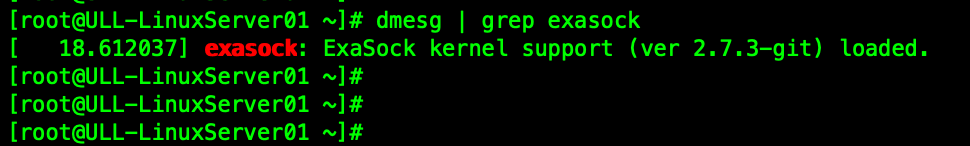

如果需要诊断和查看日志，可以增加debug和trace参数

```bash
exasock --debug --trace <application>
```

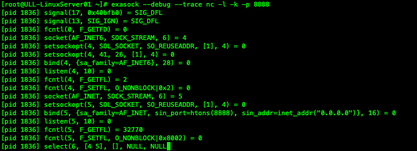


## 14. ExaSock-Stat应用：查看当前exasock使用下TCP/IP连接状态

ExaSock-Stat应用可以查看当前exasock使用下TCP/IP连接状态

```bash
exasock-stat
```

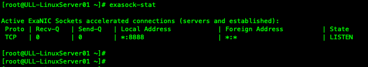


## 15. 时钟同步

使用思科智能网卡上的硬件时间戳功能之前，需要对硬件时钟进行同步。思科智能网卡支持如下几种同步方式：

- 系统时钟(Host)
- 外部PPS
- PTP网络协议
- 指定的智能网卡硬件时钟

使用方式

确认网卡上的硬件时间戳信息

```bash
ethtool -T <inteface name>
```

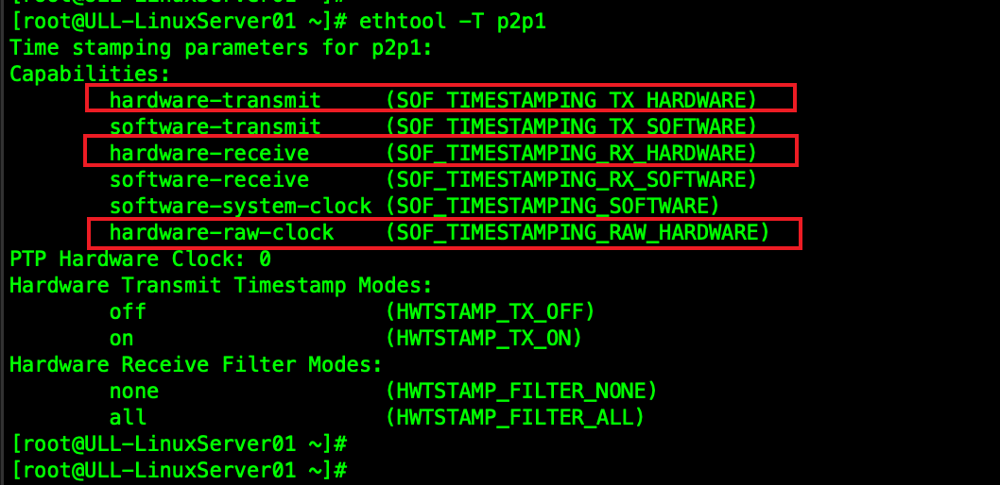

系统时钟(Host)同步

```bash
exanic-clock-sync exanic0:sys
```

外部PPS同步

```bash
exanic-clock-sync exanic0:pps
```

指定的智能网卡硬件时钟

```bash
exanic-clock-sync exanic0:exanic1
```

查看时钟同步信息

```bash
exanic-clock-check exanic0
```

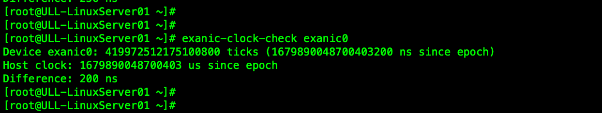


## 16. Exanic-Capture应用：支持透明加速的抓包应用

通过SmartNIC网卡对入向流量进行抓包，支持硬件时间戳

- 支持透明加速流量
- 支持硬件时间戳
- 支持nanosecond精度的pcap格式
- 支持包过滤条件

使用方式

```bash
exanic-capture -i exanic0:0 -H -N -w file001.pcap
```

 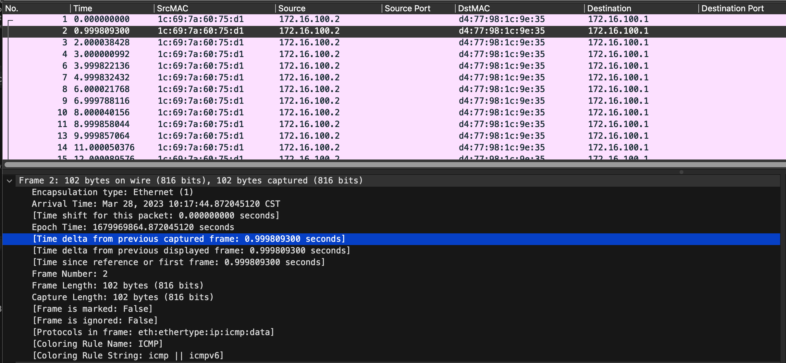


## 17. Exact-Capture应用：高速且无损的抓包应用

通过SmartNIC网卡对入向流量进行高速且无损抓包，支持10G/25G速率和皮秒级硬件时间戳

- 可指定多个网卡接口同时抓包
- 默认输出格式为expcap后缀名，可以直接在最新版本的Wireshark打开并分析（目前不支持Wireshark的Exblaze Trailer插件）
- 支持硬件时间戳，可达皮秒级精度
- 注意：时间戳格式和Nexus 3550-F HPT交换机不一致，但包含设备ID、端口ID和时间戳
- 数据包格式说明：https://www.cisco.com/c/en/us/td/docs/dcn/nexus3550/exact-capture/sw/user-guide/exact-capture-user-guide/expcap.html

10G线速无损抓包的服务器硬件要求

| 名称   | 规格                                                      |
| ------ | --------------------------------------------------------- |
| CPU    | 主频3Ghz或更高, 2 * n + 1 物理核心 (n代表10G网络端口数量) |
| Memory | 16GB DDR4或更多                                           |
| Disk   | NVMe SSD                                                  |

源码下载并安装

```bash
 wget https://github.com/cisco/exact-capture/archive/refs/heads/master.zip
 unzip master.zip
 cd exact-capture-master
 make && make install
```

使用方式

```bash
exact-capture -k -i exanic0:0 -i exanic0:1 -o /data0/ -c 0:1,2:3,4
```

注：management core = 0, NIC listener cores = 1,2, disk writer cores = 3,4

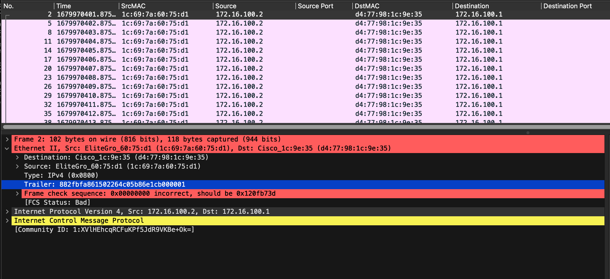


## 18. 时间戳解析脚本(Python)

由于不同设备、不同抓包工具得到的时间戳格式不一样，所以通常会造成用户的困扰。以下工具可以帮助用户方便解析pcap或expcap中的时间戳信息

下载地址：https://github.com/yazshen/cisco-ultra-low-latency/blob/main/cisco-ull-timestamps-decoder.md

使用方式

```bash
 cisco-ull-timestamps-decode.py [-h] --file <pcap file name> --type {3550fhpt,3550t,exanic,exact}
```


## 19. 抓包工具的对比和区别

|                | 流量方向 | 支持Kernel Bypass | 时间戳                         | 时间戳精度  |
| -------------- | -------- | ----------------- | ------------------------------ | ----------- |
| tcpdump        | RX + TX  | 不支持            | 默认软件时间戳，支持硬件时间戳 | nano-second |
| exanic-capture | RX Only  | 支持              | 默认软件时间戳，支持硬件时间戳 | nano-second |
| exact-capture  | RX Only  | 支持              | 默认硬件时间戳                 | pico-second |


## 20. 透明模式下双向同时抓包

Exa-Sock透明加速使用中，无法通过tcpdump捕捉数据。同时，Exa-Capture也只能捕捉RX方向数据包。如果需要同时捕捉RX+TX数据包，可以通过Mirror功能来实现，无需再借助于外部交换机进行抓包。

前提条件：K35-S(X10), K3P-S(X25), K3P-Q(X100)使用指定的固件版本，需支持端口镜像功能

打开业务端口的镜像功能

```bash
exanic-config exanic0:0 mirror-rx on
exanic-config exanic0:0 mirror-tx on
```

网卡目标端口上连接PC，然后PC上运行Wireshark进行抓包（Wireshark打开混杂模式）

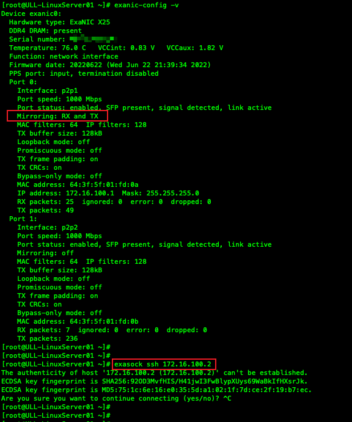

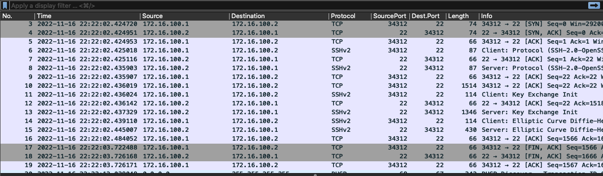


## 21. 驱动安装核对

显示内核驱动安装信息

```bash
modinfo exanic
modinfo exasock
```

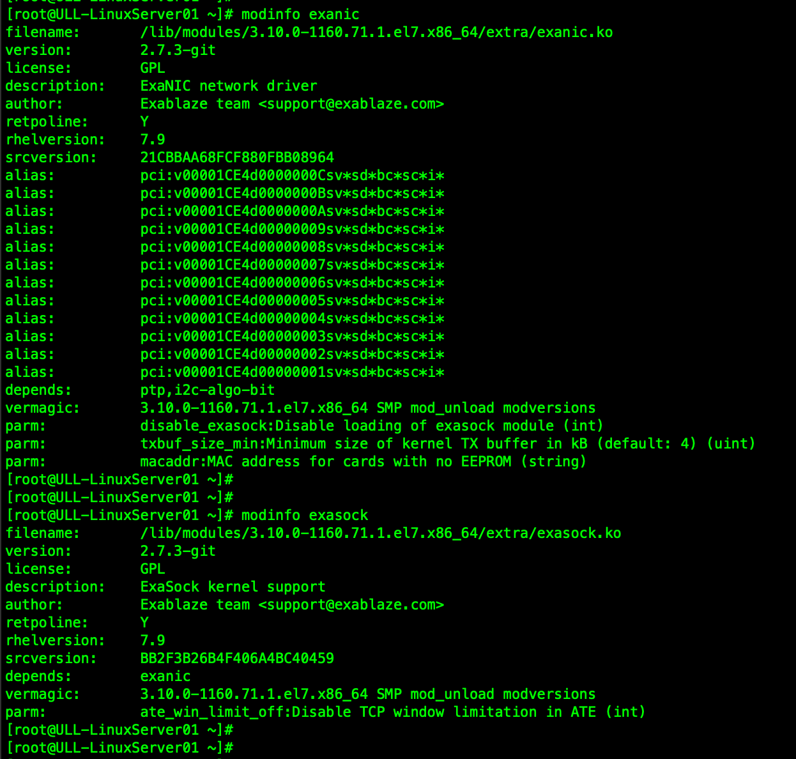

已载入的内核驱动信息

```bash
lsmod | grep -i -E "exanic|exasock"
```

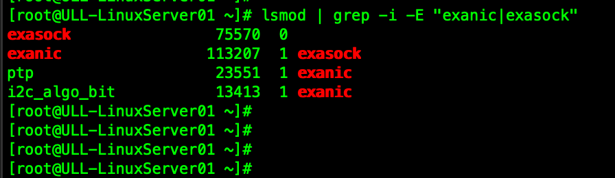

系统日志和驱动加载版本

```bash
dmesg | grep -i -E "exanic|exasock"
```

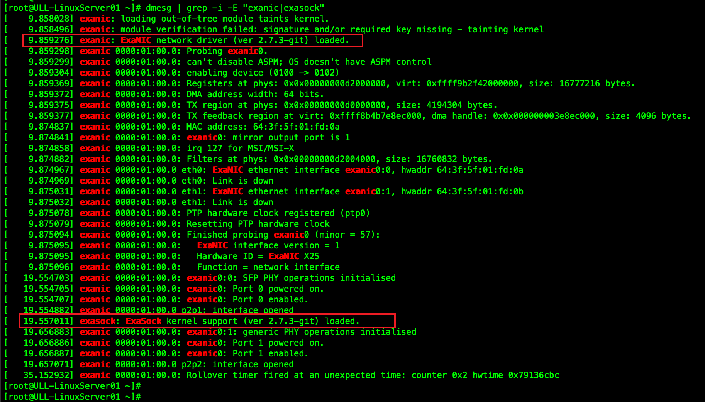

注意：exanic和exasock版本必须一致


## 22. 常见问题与解答

问题："module verification failed: signature and/or required key missing - tainting kernel"告警信息

解答：exanic的kernel驱动没有签名，所以会有这样的告警信息。可以忽略，不影响功能和使用


问题："Rollover timer fired at an unexpected time: counter 0x2 hwtime 0x79136cbc"告警信息

解答：如果您只看到一次此消息，则很可能是由另一个进程（如 NTP 或 PTP）引起的，该进程必须在启动时大量调整时钟。 如果您看到这些消息偶尔出现并且需要一点时间来恢复，则可能是另一个进程正在调整时钟或高系统负载导致计时器延迟。 如果您连续看到这些消息并且翻转超时每次都关闭几乎完全相同的数量，这表明时钟运行得太快或太慢。请注意，某些 Linux 内核（4.9.0，已在 4.14.15 中修复）对 Intel Skylake Xeon CPU 使用了不正确的 TSC 速率 - 如果您正在运行这些 CPU 之一，则应检查您的内核版本。对于 CentOS/RHEL 内核，此问题已在 3.10.0-862.2.3 中修复。


问题："modprobe: FATAL: Module exanic is in use."告警信息，无法卸载内核驱动

解答：内核驱动包括：exanic和exasock。默认exanic会被exasock使用，所以我们需要先移除exasock，才能再移除exanic

建议运行如下命令，并保持顺序：

```bash
modprobe -r exasock
modprobe -r exanic
```


问题：通过exact-capture生成的expcap或pcap文件，无法通过Wireshark显示时间戳信息

解答：Wireshark默认包含了Exablaze trailer解析工具，但是该工具仅适用于Nexus 3550-F HPT交换机输出的数据包。


## 23. 思科售后技术支持服务

服务有效期内，思科售后技术支持服务可以为客户提供：功能和配置咨询、故障诊断、硬件翻修等售后服务。

服务方式：电话、电子邮件或WebEx在线会议等远程协助方式。

服务次数：服务有效期内无技术支持次数限制。

如何申请服务

1. 电话方式：800 810 8886 ｜ 400 810 8886 （支持中文服务）
2. 邮件方式：[chinese-tac@cisco.com](mailto:chinese-tac@cisco.com) (支持中文服务)
3. 网页方式：https://mycase.cloudapps.cisco.com/case

需提供如下信息

1. 思科CCO账号
2. 服务合同号
3. 硬件序列号

服务等级定义

1. Severity 1: 您的网络已“停机”，或者您的业务运营受到严重影响。思科将全天候投入必要的资源与您一起解决该问题
2. Severity 2: 现有网络的运行性能严重下降，或者业务运营的重要方面受到思科产品性能问题的重大影响。思科将在正常工作时间内投入相当的资源与您一起来解决该问题
3. Seveirty 3: 您的网络的运行性能降低，但大多数业务仍可正常运行。思科将调动资源在正常工作时间内与您一起将服务恢复到令人满意的水平
4. Severity 4: 您需要有关思科产品功能、安装或配置方面的信息或协助。这对业务运作不产生或产生很小的影响

如果客户没有特别要求，默认服务等级为Severity 3

建议：一个问题一个技术支持请求

升级服务请求：如果您对当前技术支持服务的进度、服务质量或解决方案不满意，可以联系技术支持值班经理进行申诉 http://www.cisco.com/c/zh_cn/support/web/tsd-cisco-worldwide-contacts.html 

